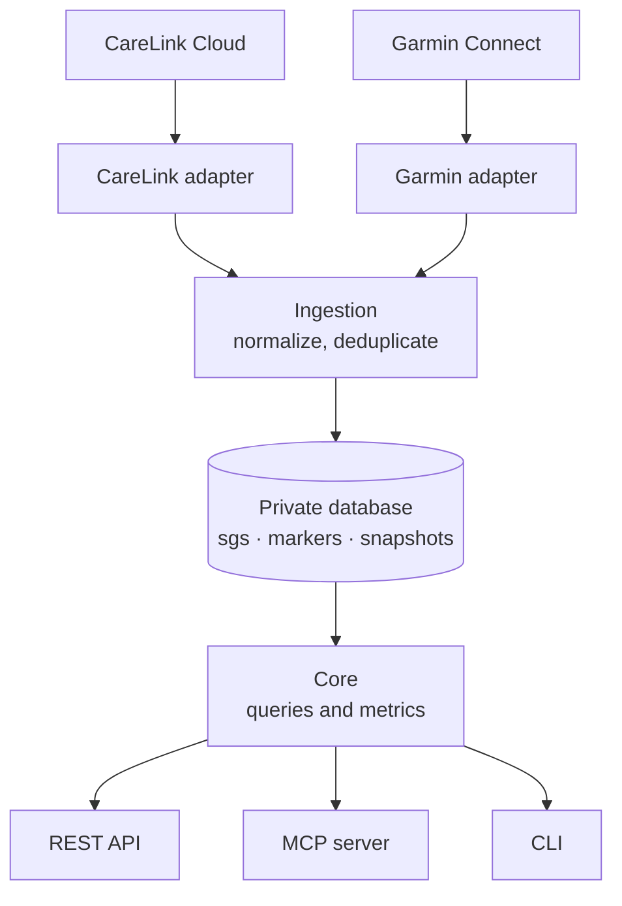

# glucose-pipeline

A personal health data pipeline. It pulls continuous glucose monitor and insulin pump data out of Medtronic CareLink, persists it in a private database, and exposes it through a REST API — so the data is queryable from anywhere instead of trapped behind a vendor dashboard.

An MCP server sits on top as one consumer among several, which lets an LLM answer questions like "how was my glucose last Tuesday afternoon?" without me pasting screenshots.

## Why

CareLink only exposes roughly the last 24 hours of sensor data. Ask it about last month and there is nothing to query. Anything built on live calls to CareLink can therefore only ever answer questions about today.

Persisting the data solves that, and it also decouples the useful part (my history) from the fragile part (a reverse-engineered vendor client that may break at any time).

## Architecture



Adapters are the only components that know about vendor APIs. Everything downstream speaks a normalized internal schema. If a vendor changes their API, the blast radius is one folder.

`core/` knows nothing about HTTP or MCP. It takes dates and returns plain data structures. The API, the MCP server, and the CLI are all thin layers over the same functions.

Glucose is the primary concern. Garmin is a second, independent source — the two are joined at query time, not coupled at ingestion.

## Data model

Three tables, derived from the actual shape of the CareLink payload rather than guessed up front.

| Table | Contents |
|---|---|
| `sgs` | Sensor glucose readings, one every five minutes |
| `markers` | Therapy events: boluses, meals, auto basal delivery, auto mode status, low glucose suspend |
| `snapshots` | Point-in-time device and summary state: active insulin, reservoir, time in range, average SG |

Markers keep their vendor payload in a JSON column alongside the extracted columns. New fields from the vendor are preserved rather than silently dropped.

## Status

Early. Working so far:

- [x] CareLink authentication and token refresh
- [x] Raw payload retrieval
- [ ] Schema and persistence
- [ ] Scheduled ingestion
- [ ] REST API
- [ ] MCP server
- [ ] Garmin source

## Setup

Requires Python 3.12+.

```bash
python3 -m venv .venv
source .venv/bin/activate
pip install -r requirements.txt
```

CareLink authentication is bootstrapped once on a machine with a display. The resulting token file refreshes itself from then on.

## Security

This repository stores nothing sensitive. Token files and data dumps are gitignored and must stay that way.

The database holds personal medical data. If deployed anywhere reachable from the internet, the API requires authentication — no exceptions.

## Disclaimer

Not a medical device. Not affiliated with or endorsed by Medtronic. Nothing here should be used to make treatment decisions, and it may break at any time as it depends on undocumented vendor endpoints.

## Credits

CareLink access builds on [ondrej1024/carelink-python-client](https://github.com/ondrej1024/carelink-python-client), which builds in turn on Pal Marci's and Bence Szász's reverse engineering work.
